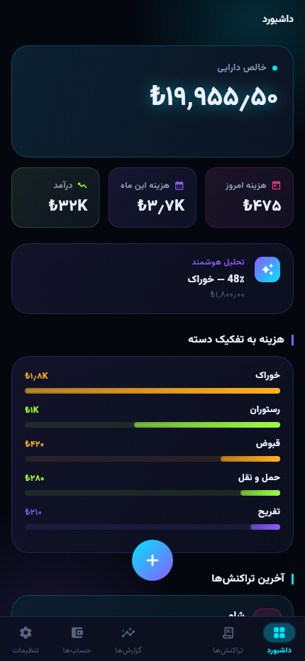
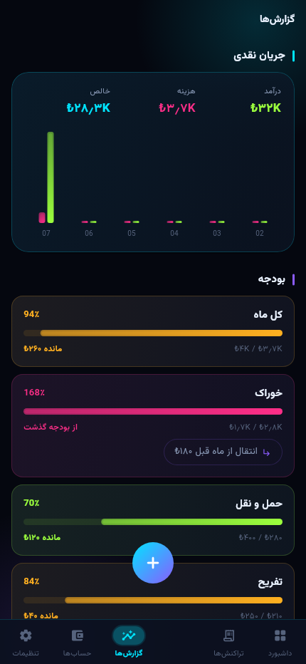
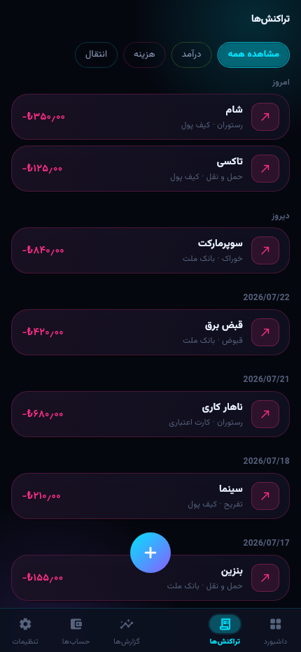

# Finora — Personal Financial Operating System

> نام کاری پروژه: **Finora** (گزینه‌های جایگزین: LedgerOne / MyFinance OS / FinHub)

Finora یک **سیستم‌عامل مالی (Financial OS / Personal ERP)** برای افراد، خانواده‌ها و
کسب‌وکارهای کوچک است؛ نه صرفاً یک نرم‌افزار حسابداری شخصی.

هدف: ترکیبی از YNAB + MoneyWiz + Notion + QuickBooks + Splitwise + Portfolio Tracker + AI Assistant،
اما با رابط کاربری بسیار ساده و چندزبانه (فارسی، English، Türkçe، العربية) با پشتیبانی کامل RTL/LTR.

---

## وضعیت پروژه

هر ده فاز نقشه راه (M0 تا M10) پیاده‌سازی و تست شده است.

| سنجه | مقدار |
|---|---|
| ماژول دامنه | **۲۴** |
| تست Backend | **۵۶۷ تست / ۶۳۸۷ ادعا** — همه سبز |
| تست اپ | **۲۵۳ تست + ۱۱ تصویر Golden** — همه سبز |
| مسیر API | **۱۷۵** |

**Backend** — Core، Ledger، Budget، Reports، Banking، Investment، Assets،
Buildings، Business، Travel، Family، Recurring، Documents، Search، AI، Sync،
Billing، Alerts، Audit، I18n، Security، DataOps، MarketData، Capture.

**اپ** — داشبورد، تراکنش‌ها، گزارش‌ها، حساب‌ها، تنظیمات، به‌علاوهٔ صفحات
بانک، سرمایه‌گذاری، دارایی، سفر، ساختمان، کسب‌وکار و AI؛ چهار زبان با RTL واقعی.

از تنظیمات هم می‌شود به ورود دومرحله‌ای، اعضا و دعوت‌ها، گزارش فعالیت و
گزارش امنیتی، خروجی گرفتن از داده‌ها و حذف حساب رسید — یعنی همان چیزهایی
که تا پیش از این فقط در سمت سرور وجود داشتند.

جزئیات آنچه عمداً باقی مانده در [`docs/04-roadmap.md`](docs/04-roadmap.md).

### اجرا

```bash
docker compose up -d                       # MySQL, Redis, Meilisearch, MinIO, Mailpit
cd backend && composer install && php artisan migrate && php artisan serve
cd app     && flutter pub get && flutter run
```

### نمای اپ

<p align="center">
  
  
  
</p>

این تصاویر دستی گرفته نشده‌اند — خروجی تست‌های Golden هستند و با هر تغییر
بصری دوباره تولید می‌شوند.

---

## نقشهٔ مستندات

| سند | موضوع |
|---|---|
| [docs/00-vision.md](docs/00-vision.md) | چشم‌انداز، پرسونا، ارزش پیشنهادی، محدودهٔ محصول |
| [docs/01-architecture.md](docs/01-architecture.md) | معماری کلان، Backend، Flutter، زیرساخت |
| [docs/02-modules.md](docs/02-modules.md) | کاتالوگ کامل ماژول‌ها و مرزهای دامنه |
| [docs/03-data-model.md](docs/03-data-model.md) | مدل داده، جداول اصلی، چندارزی، دفتر کل |
| [docs/04-roadmap.md](docs/04-roadmap.md) | **نقشه راه فازبندی‌شده (M0 تا M10)** |
| [docs/05-api-conventions.md](docs/05-api-conventions.md) | قراردادهای REST API، نسخه‌بندی، خطاها |
| [docs/06-i18n-rtl.md](docs/06-i18n-rtl.md) | چندزبانگی، Translation Database، RTL |
| [docs/07-security.md](docs/07-security.md) | امنیت، رمزنگاری، دسترسی‌ها، Audit Log |
| [docs/08-ai-layer.md](docs/08-ai-layer.md) | لایهٔ هوش مصنوعی، OCR، NLP، جستجوی معنایی |
| [docs/09-sync-offline.md](docs/09-sync-offline.md) | Offline-First، موتور همگام‌سازی، حل تعارض |
| [docs/10-quality-and-dod.md](docs/10-quality-and-dod.md) | استاندارد کیفیت، تست، CI/CD، Definition of Done |

---

## اصول پایه‌ای که هیچ‌گاه نقض نمی‌شوند

1. **Workspace-first** — هر داده متعلق به یک Workspace است؛ هیچ کوئری بدون `workspace_id` نوشته نمی‌شود.
2. **Multi-currency by default** — هر مبلغ همیشه با ارز، نرخ تبدیل و معادل ارز پایه ذخیره می‌شود.
3. **Minor units** — مبالغ به صورت عدد صحیح (کوچک‌ترین واحد ارز) ذخیره می‌شوند؛ هرگز `float`.
4. **Modular** — هر دامنه یک ماژول مستقل با مرز مشخص؛ ارتباط بین ماژول‌ها فقط از طریق Event و Contract.
5. **Offline-First** — اپلیکیشن بدون اینترنت کاملاً کار می‌کند و بعداً همگام می‌شود.
6. **همهٔ متن‌ها از Translation Database** — هیچ رشتهٔ نمایشی hard-code نمی‌شود.
7. **AI فقط روی دادهٔ همان Workspace** — بدون نشت داده بین Workspaceها.

---

## مجوز

هنوز تعیین نشده — پیش از انتشار عمومی مشخص می‌شود.
